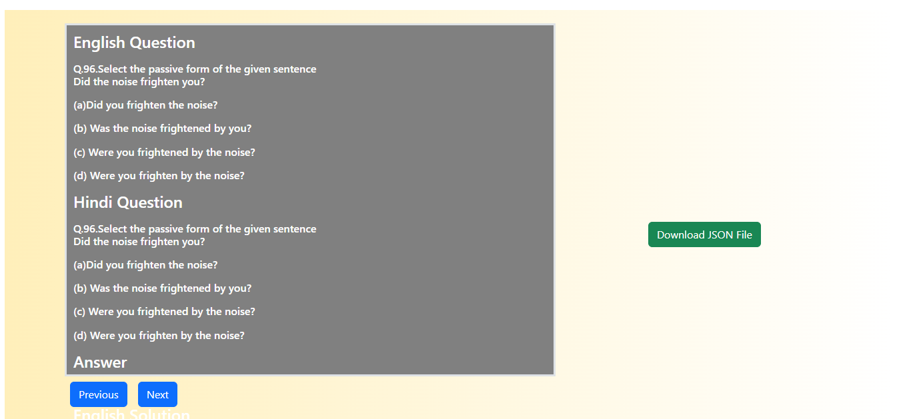
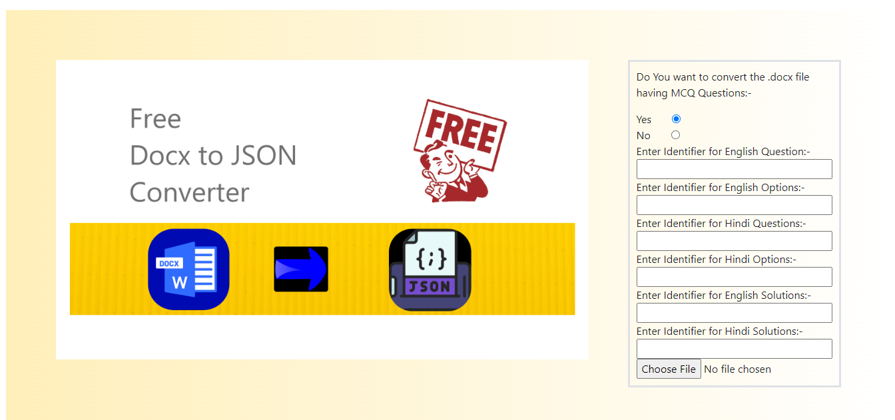

# docx2json


<p align="center">
  <a href="#">
    
  </a>
</p>

<p align="center">
  <a href="#">
    
  </a>
</p>


## Features

- Upload Docx file from your computer system
- According to your need like if you wanna simply extract all the texts, images and even equations got that into JSON.
- Another facility is that, even if you want to extract MCQ questions into JSON for each single question set got a JSON object.
- Works very faster even got each of your images with its own Data/base64 url.
- Within a moment just convert your docx file into JSON.


## Development

### Install dependencies

```sh
$ npm install
```

### Start development server

```sh
$ npm run start -- --open
```

### Build for production

```sh
$ npm run build
```

## License

[The MIT License (MIT)](https://github.com/Kunwar-Abhishek-Singh/docx2json/blob/main/LICENSE)
